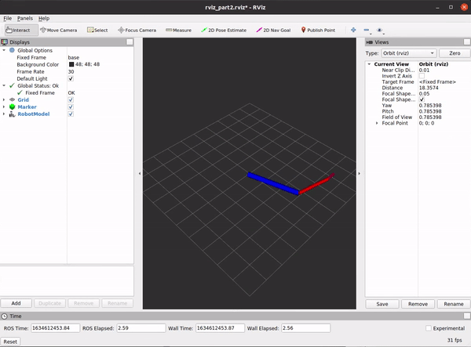

<h1>Homework 2</h1>

Anna Garverick

<h2>Part I: Turtle Trajectories</h2>

This package offers two modes, "sim" and "real". In sim, the turtle in turtle sim follows a figure eight pattern calculated from the provided width, height and period parameters. Additionally, this mode simulates the transform from the frame of turtle sim to frame of the turtle bot. 

To run the simulation, launch the launchfile figure_eight.launch. Sim is set as the default mode, so the mode specification is optional. 

    roslaunch homework2 figure_eight.launch mode:=sim
    
To start the turtle, call the Resume service.    
    
    rosservice call /Resume

The turtle may be paused with the Pause service, as resumed again with the same Resume service.
    
    rosservice call /Pause
    rosservice call /Resume

The dimensions of the figure eight may be editted in the trajectory.yaml file, where the width, height, and period are specified. 

With the real mode, velocity messages are instead sent to the TurtleBot hardware. The TurtleBot will follow the same path as the turtle in the simulation, with some discreptancies due to the realities of a robot existing in the 'real world.' The values in the parameter file should be updating according to space limitations (distance values are in meters), and the period should be long enough to allow the bot to follow all the movement commands (around 45 seconds should work).  

**TurtleBot video: 
https://youtu.be/zBIMHzM5mfM**

<h2>Part II: Xacro ARM</h2>

The second part of this package creates a 2R robot arm and publishes joint states to make the arm's end effector follow a linear path. Markers are spawned at a fixed rate with green spheres indicating positive x coordinate values, and red cubes indicating negative x coordinate values.

The launch file is broken into two parts, with the option to either have joint states published from the trajectory node, or manually through the joint state GUI. 

The arm_basics launch file calls rviz, the xacro file, and the yaml parameters file to display the robot at the home joint states. It also calls the robot state publisher to visualize the transforms used to display the markers. Finally, it uses an arg to either call the arm_traj node and have Joint States published automatically, or call the Joint States GUI so joint states may be controlled manually from the rviz GUI. In the arm_mark launch files, the arm_basics launchfile is included and the arm_marker node is called to display markers at the end effector. To run both launch files so the markers are visible, run the arm_mark launch file. By default, the arm trajectory will be controlled by the trajectory node. Alternatively, the joint states GUI may be used to set the joints manually by setting use_jsp to true.

    roslaunch homework2 arm_mark.launch use_jsp:=false

    roslaunch homework2 arm_mark.launch use_jsp:=true

The arm lengths and radii, and the cycle period may be changed in the arm.yaml file.

